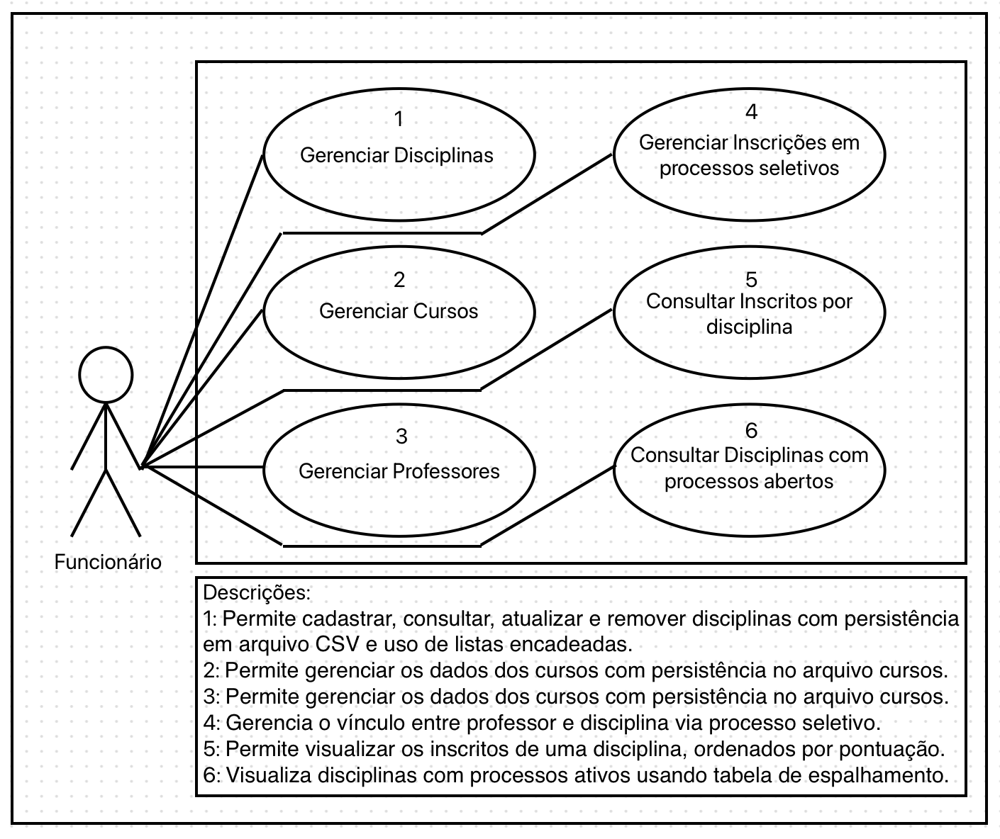
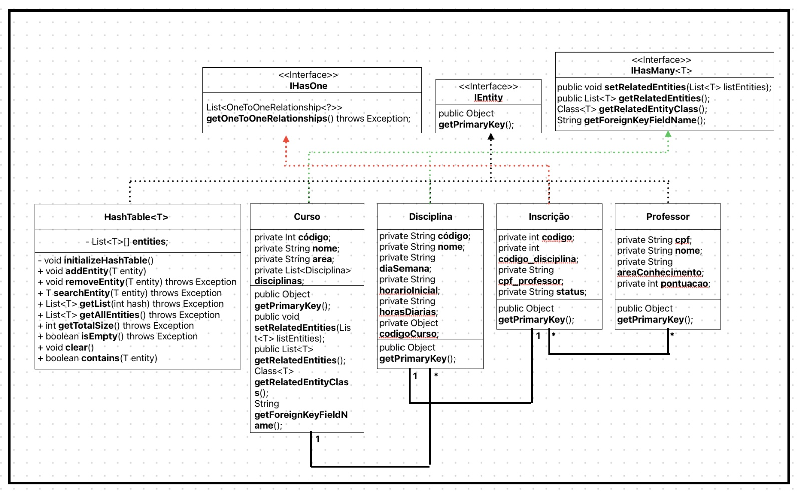

<!-- Documentação para criação do arquivo README.md -->
<!-- https://docs.github.com/pt/get-started/writing-on-github/getting-started-with-writing-and-formatting-on-github/basic-writing-and-formatting-syntax -->
# 📚 Trabalho Semestral ED - Gerenciamento de Docentes

## 🎯 Domínio da Aplicação
### Domínio:
Uma faculdade deve fazer uma chamada pública para contratação temporária de docentes. Apenas funcionários tem acesso ao sistema. É necessário ter um arquivo chamado `disciplinas.csv` com as disciplinas disponíveis, é importante ter cadastrado o código da disciplina, o nome da disciplina, o dia da semana que será ministrada, o horário inicial que será ministrada, a quantidade de horas diárias e o código
do curso ao qual a disciplina se adequa (`Uma disciplina pertence a apenas um curso`). Os cursos também devem estar disponibilizados em um arquivo chamado `cursos.csv` e, lá devem estar o código do curso, o nome do curso e a área do conhecimento ao qual ele pertence. Cada oferecimento de disciplina tem um
código de processo. 
Todos os professores que se inscreverem em algum processo devem estar cadastrado
no sistema  (`Arquivo professor.csv`), com seu CPF, nome, área a qual pretende se inscrever e quantidade de
pontos que faz no momento (`a pontuação é conferida por um funcionário antes de ser inserida`). Por fim,
deve haver um arquivo `inscricoes.csv`, onde deve constar (`apenas dos processos ativos`) o CPF do professor,
o código da disciplina e o código do processo.

> [!WARNING]
> Não se deve fazer inserções de dados diretamente nos arquivos CSV, apenas via sistema.

O sistema deve conter, uma tela para CRUD (`inserção, atualização, remoção e consulta`) de disciplinas,
cursos, professor e inscrições em processos seletivos (`1 Tela de CRUD para cada, que se comunica com os
arquivos`). As operações de atualização, remoção devem envolver listas encadeadas (`Os arquivos não
podem ficar com linhas vazias após operações`). Ao remover uma disciplina, todos os dados de inscrições
daquela disciplina, devem ser excluídos também. A consulta de disciplinas, cursos e professores, devem
vir de uma fila populada a partir dos seus respectivos arquivos.
Deve haver uma tela para consulta de inscritos de uma disciplina. O conteúdo da tela deve ser montado a
partir de uma lista, ordenada pela pontuação (`deve-se aplicar algum algoritmo de ordenação trabalhado
em aula, não sendo permitido o uso de classes internas do Java`), populada com os dados do arquivo de
inscrições. (`Deve se exibir na tela, todos os dados dos professores, não apenas seu CPF`).
Deve haver uma tela para consulta de todos as disciplinas de todos os cursos que têm processos abertos.
Para tanto, deve-se popular uma tabela de espalhamento com uma função hash criada pelo desenvolvedor
do sistema.

---
📋 **Requisitos Funcionais – Sistema de Processo Seletivo de Docentes**

🔐 **Acesso ao Sistema** 

**RF01** – O sistema deve permitir acesso apenas a funcionários cadastrados. 

 

📁 **Manipulação de Arquivos CSV** 

**RF02** – O sistema deve ler e gravar dados exclusivamente através do sistema, não permitindo edição direta dos arquivos CSV. 

**RF03** – O sistema deve manipular os seguintes arquivos: 

disciplinas.csv 
cursos.csv 
professores.csv 
inscricoes.csv 
 

📚 **CRUDs Individuais (Cada um com tela própria)** 

🟩 **Disciplinas** 

**RF04** – Deve haver uma tela de CRUD para disciplinas, com as seguintes funcionalidades: 

Inserir nova disciplina 
Atualizar dados da disciplina 
Remover disciplina (e suas inscrições associadas) 
Consultar disciplinas (usando fila)

**RF05** – A disciplina deve conter os seguintes campos: 

Código da disciplina 
Nome da disciplina 
Dia da semana 
Horário inicial 
Quantidade de horas diárias 
Código do curso associado

**RF06** – Ao remover uma disciplina, o sistema deve também remover todas as inscrições associadas a essa disciplina do arquivo inscricoes.csv. 

 

🟦 **Cursos** 

**RF07** – Deve haver uma tela de CRUD para cursos, com as funcionalidades de inserir, atualizar, remover e consultar. 

**RF08** – O curso deve conter: 

Código do curso 
Nome do curso 
Área do conhecimento 
 

🟨 **Professores** 

**RF09** – Deve haver uma tela de CRUD para professores, com: 

Cadastro do CPF 
Nome 
Área de inscrição 
Quantidade de pontos

**RF10** – A pontuação do professor deve ser validada e inserida por um funcionário. 

 

🟧 **Inscrições em Processos Seletivos** 

**RF11** – Deve haver uma tela de CRUD para inscrições, onde se possa: 

Cadastrar uma inscrição com: CPF do professor, código da disciplina e código do processo (apenas se o processo estiver ativo) 
Atualizar e remover inscrições 
Consultar inscrições 
 

🔄 **Estruturas de Dados Obrigatórias** 

**RF12** – As operações de atualização e remoção dos arquivos devem ser feitas utilizando listas encadeadas, sem deixar linhas vazias nos arquivos. 

**RF13** – As consultas de disciplinas, cursos e professores devem utilizar uma fila (FIFO) para exibir os dados em tela. 

 

🔍 **Tela de Consulta de Inscritos por Disciplina** 

**RF14** – Deve haver uma tela para consultar os inscritos em uma disciplina específica, mostrando: 

Todos os dados dos professores inscritos (não apenas CPF) 
Ordenação por pontuação (maior para menor)

**RF15** – A lista exibida deve ser montada com base no arquivo inscricoes.csv, utilizando: 

Lista de inscritos 
Algoritmo de ordenação implementado manualmente, sem uso de bibliotecas internas do Java.

---

## 📌 Casos de Uso

---

## 📦 Diagrama de Classes

---

## 💻 Tecnologias Utilizadas

- **Java SE-21+**
- **Java Swing** – interface gráfica
- **Arquivos CSV** – persistência de dados local
  

---
## 🗂️ Estrutura do Projeto

A estrutura segue os princípios da Clean Architecture, com separação clara entre camadas de domínio, casos de uso, interface, adaptação e persistência.

<b>`/src`</b> 
│ 
├── `/domain` # Regras de negócio e entidades 
│ ├── `/entities` # Camada de Modelos 
│ └── `/repositories` # Interfaces para persistência de dados 
│ 
├── `/adapters` # Camada de persistência e mapeamentos 
│ ├── `/database` # Implementações das funcionalidades de persistencias 
│ └── `/mappers` # Conversões de dados para objetos Java 
│ 
├── `/controllers` # Comunicação entre views e usecases 
│ 
├── `/utils` # Classes Auxiliares (Lista,No, Hash,Etc.) 
│ 
├── `/views` # Interface com o usuário 
│ 
└── `Main.java` # Classe principal, ponto de entrada da aplicação 

---

## 🧑‍💻 Equipe

- **Desenvolvedores/Alunos:**
  - [Maykon Wlliam](https://github.com/MaykonWilliam)
  - [Lucas Bezerra](https://github.com/LucasBMacedo)
  - [André Oliveira Batista](https://github.com/AndreOliveiraBatista)
  - [Vinicius de Souza Moreira](https://github.com/Vineee95)
  
- **Disciplina:** Estrutura de Dados - ED
- **Professor:** [Leandro Colevati](https://github.com/lecolevati)
- **Instituição:** FATEC Zona Leste - Análise e Desenvolvimento de Sistemas
